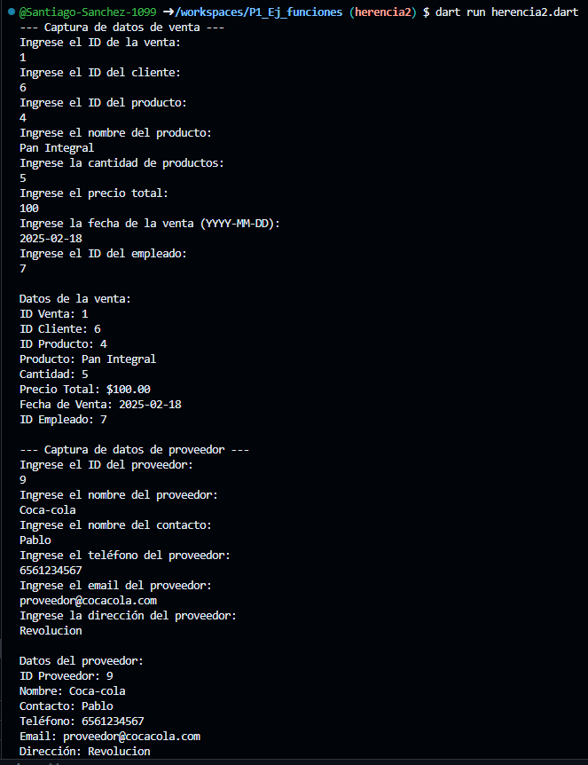

Crear la clase Ventas con los atributos (id_venta, id_cliente, id_producto, producto, cantidad_productos, total_precio, fecha_venta, id_empleado) con una función capturadatos(), con interacción de interfaz de usuario. Crear la clase DatosVenta con herencia Ventas y una función mostrarDatos(). Crear otra clase Proveedores con los atributos (id_proveedor, nombre_proveedor, contacto, telefono, email, direccion) con una función capturadatos(), con interacción de interfaz de usuario. Crear la clase DatosProveedor con herencia Proveedor y una función mostrarDatos(). Lenguaje dart. Al final unir los dos codigos en uno mismo

