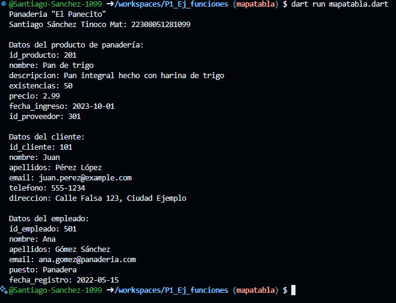

Crear 3 mapas:
<String, dinamic> productos (panaderia) con los siguientes key: id_producto, nombre, descripcion, existencias, precio, fecha_ingreso, id_proveedor.
<String, dinamic> clientes con los siguientes key: id_cliente, nombre, apellidos, email, telefono, direccion.
<String, dinamic> empleados con los siguientes key: id_empleado, nombre, apellidos, email, puesto, fecha_registro.
Mostrar los datos con un for each. lenguaje dart

Salida de datos:
